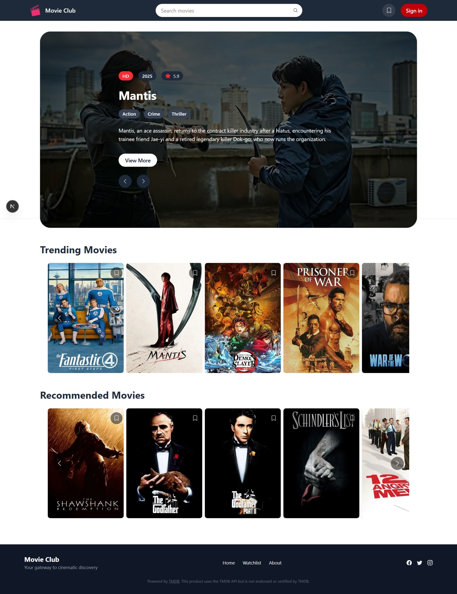
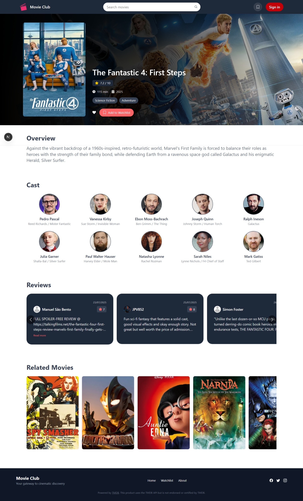
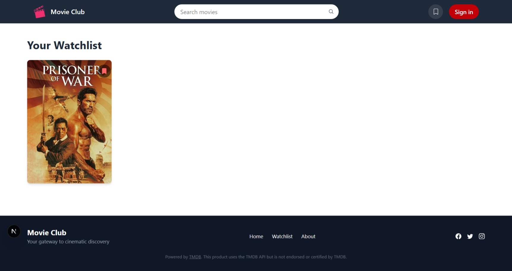

#  Movie Club

Movie Club is a sleek, responsive movie discovery app built with **Next.js**, **TypeScript**, and **TailwindCSS**. It integrates with the TMDB API to showcase trending, recommended, and currently playing movies — complete with genre pills, ratings, watchlist functionality, and elegant UI components.

---

## 🚀 Features

- Hero section with dynamic backdrop, genre pills, and “View More” navigation
- Movie detail pages with full metadata, cast, reviews, and similar titles
- Watchlist functionality with localStorage persistence
- Review cards with modal expansion for full content
- Fully responsive layout for mobile, tablet, and desktop
- Clean design powered by TailwindCSS and custom components

## 🧰 Tech Stack

- **Framework**: [Next.js](https://nextjs.org/)
- **Language**: TypeScript
- **Styling**: TailwindCSS
- **Icons**: React Icons
- **Data Source**: [TMDB API](https://www.themoviedb.org/documentation/api)


## 🛠️ Setup

### 1. Clone the repository

```bash
git clone https://github.com/your-username/frontend-movie-app.git
cd frontend-movie-app
```
### 2. Install dependencies
```bash
npm install
```
### 3. Configure environment variables
Create a .env.local file and add your TMDB API key:
```env
NEXT_PUBLIC_TMDB_API_KEY=your_tmdb_api_key_here
```
### 4. Run the development server
```bash
npm run dev
```

## 📁 Project Structure
```
├── components/
│   ├── common/         # Reusable UI components (e.g. ReviewCard, MovieCarousel)
│   ├── layout.tsx      # Navbar, Footer, and layout wrapper
│   ├── HeroSection.tsx # Homepage hero component
├── pages/
│   ├── index.tsx       # Homepage
│   ├── movies/[id].tsx # Dynamic movie detail page
├── utils/              # Watchlist logic, API helpers
├── public/             # Static assets
```
## 📸 Screenshots

### Homepage  


### Movie Detail Page  


### Watch List Page  


## 🧪 Future Enhancements
- Include Tv Shows
- Genre-based filtering
- User authentication and profile

## License
This project is licensed under the MIT License.